# Business Central Table Relationship Schema for OCPF APIs

## Purpose

This document expands the earlier relationship overview so it includes the full set of tables exposed by the OCPF API catalog and identifies the Business Central field(s) that drive each relationship. The mappings below are based on standard Business Central table patterns and the common AL relationship design used by the exposed API pages.

> Scope note: this is a logical schema for the API-backed tables in the catalog. It focuses on the primary parent/child and lookup relationships that matter for integration design, reporting, and downstream joins.

> **Revision note (v3.1, July 2026):** updated for the v3.1 catalog — added the Ship-to Address entity and the new **Manufacturing & Assembly** and **Service Management** categories (65 new entities, families 7 and 8 below). The v3.1 field additions to existing entities (Credit Limit (LCY), Value Entry cost amounts, LCY/Qty flow fields, …) are additive and do not change any relationship keys. Also corrected the entity map: removed a duplicate SKU node and normalized three arrows to the parent → child convention (G/L Register → G/L Entry, Location → Warehouse Entry, Company Information → Document Attachment).

## Relationship Notation

- 1:N = one parent record to many child records
- N:1 = many child records to one parent record
- 1:1 = one-to-one relationship

## Relationship Key Conventions in Business Central

Most Business Central table relations are driven by a small set of recurring key fields:

- Customer relationships: Customer No., Sell-to Customer No., Bill-to Customer No.
- Vendor relationships: Vendor No., Buy-from Vendor No., Pay-to Vendor No.
- Item relationships: Item No., No.
- Document relationships: Document Type, Document No., Line No., Entry No.
- Financial relationships: G/L Account No., Account No., Posting Group, Dimension Set ID
- Header/line relationships: Document No. on the line points to the header’s No.
- Manufacturing relationships: Routing No., Production BOM No., Work Center No., and the composite Status + Prod. Order No. (+ Prod. Order Line No.) on production order child tables
- Service relationships: Service Item No., Contract Type + Contract No., and Document Type + Document No. on service document child tables

These are the standard types of fields that connect tables in BC and are the ones used below as the relationship-driving fields.

---

## Full Entity Map (all tables in the catalog)

```mermaid
flowchart LR
    subgraph CoreFinancial["Core Financial"]
        GLA["G/L Account"]
        GLE["G/L Entry"]
        GLS["General Ledger Setup"]
        AP["Accounting Period"]
        GLEB["G/L Budget Entry"]
        GLR["G/L Register"]
        CLE["Cust. Ledger Entry"]
        DCLE["Detailed Cust. Ledg. Entry"]
        VLE["Vendor Ledger Entry"]
        DVLE["Detailed Vendor Ledg. Entry"]
        ELE["Employee Ledger Entry"]
        GBP["Gen. Business Posting Group"]
        GPP["Gen. Product Posting Group"]
        GPS["General Posting Setup"]
        CPG["Customer Posting Group"]
        VPG["Vendor Posting Group"]
        IPG["Inventory Posting Group"]
        VBP["VAT Business Posting Group"]
        VPP["VAT Product Posting Group"]
        VPS["VAT Posting Setup"]
        DIM["Dimension"]
        DIV["Dimension Value"]
        DFD["Default Dimension"]
        DSE["Dimension Set Entry"]
        IPS["Inventory Posting Setup"]
    end

    subgraph MasterData["Master Data"]
        BA["Bank Account"]
        BAPG["Bank Account Posting Group"]
        BALE["Bank Account Ledger Entry"]
        PT["Payment Terms"]
        PM["Payment Method"]
        CUR["Currency"]
        CR["Country/Region"]
        UOM["Unit of Measure"]
        IUOM["Item Unit of Measure"]
        LOC["Location"]
        ICAT["Item Category"]
        SM["Shipment Method"]
        CUST["Customer"]
        VEND["Vendor"]
        CONT["Contact"]
        CBR["Contact Business Relation"]
        ITEM["Item"]
        ILE["Item Ledger Entry"]
        VE["Value Entry"]
        IAE["Item Application Entry"]
        IVC["Item Vendor"]
        SKU["Stockkeeping Unit"]
        ITC["Item Tracking Code"]
        ICH["Item Charge"]
        RES["Resource"]
        RLE["Res. Ledger Entry"]
        RGR["Resource Group"]
        EMP["Employee"]
        SP["Salesperson/Purchaser"]
        STA["Ship-to Address"]
    end

    subgraph Sales["Sales"]
        SH["Sales Header"]
        SL["Sales Line"]
        SIH["Sales Invoice Header"]
        SIL["Sales Invoice Line"]
        SCH["Sales Cr.Memo Header"]
        SCL["Sales Cr.Memo Line"]
        SSH["Sales Shipment Header"]
        SSL["Sales Shipment Line"]
        RRH["Return Receipt Header"]
        RRL["Return Receipt Line"]
        SBO["Sales Blanket Order"]
        SBOL["Sales Blanket Order Line"]
    end

    subgraph Purchasing["Purchasing"]
        PH["Purchase Header"]
        PL["Purchase Line"]
        PIH["Purch. Inv. Header"]
        PIL["Purch. Inv. Line"]
        PCH["Purch. Cr. Memo Hdr."]
        PCL["Purch. Cr. Memo Line"]
        PRH["Purch. Rcpt. Header"]
        PRL["Purch. Rcpt. Line"]
        RSH["Return Shipment Header"]
        RSL["Return Shipment Line"]
        PQ["Purchase Quote"]
        PQL["Purchase Quote Line"]
        PBO["Purchase Blanket Order"]
        PBOL["Purchase Blanket Order Line"]
    end

    subgraph ProjectsAssets["Projects & Assets"]
        JOB["Job"]
        JTG["Job Task"]
        JPL["Job Planning Line"]
        JLE["Job Ledger Entry"]
        JPG["Job Posting Group"]
        FA["Fixed Asset"]
        FAG["FA Posting Group"]
        FAL["FA Ledger Entry"]
        FADB["FA Depreciation Book"]
        GJT["Gen. Journal Template"]
        GJB["Gen. Journal Batch"]
        GJL["Gen. Journal Line"]
        PLH["Price List Header"]
        PLL["Price List Line"]
    end

    subgraph Manufacturing["Manufacturing & Assembly (new in v3.1)"]
        MFS["Manufacturing Setup"]
        WSH["Work Shift"]
        SHC["Shop Calendar"]
        SCWD["Shop Calendar Working Days"]
        WCG["Work Center Group"]
        WC["Work Center"]
        MC["Machine Center"]
        CUOM["Capacity Unit of Measure"]
        CE["Calendar Entry"]
        CAE["Calendar Absence Entry"]
        STOP["Stop"]
        SCRAP["Scrap"]
        RLINK["Routing Link"]
        STASK["Standard Task"]
        RTH["Routing Header"]
        RTL["Routing Line"]
        RTV["Routing Version"]
        PBH["Production BOM Header"]
        PBL["Production BOM Line"]
        PBV["Production BOM Version"]
        FAM["Family"]
        FAML["Family Line"]
        PO["Production Order"]
        POL["Prod. Order Line"]
        POC["Prod. Order Component"]
        PORL["Prod. Order Routing Line"]
        POCN["Prod. Order Capacity Need"]
        CAPLE["Capacity Ledger Entry"]
        ASU["Assembly Setup"]
        BOMC["BOM Component"]
        AH["Assembly Header"]
        ALN["Assembly Line"]
        PAH["Posted Assembly Header"]
        PAL["Posted Assembly Line"]
    end

    subgraph Service["Service Management (new in v3.1)"]
        SMS["Service Mgt. Setup"]
        SOT["Service Order Type"]
        SCST["Service Cost"]
        SZ["Service Zone"]
        SIG["Service Item Group"]
        RST["Repair Status"]
        FAR["Fault Area"]
        SYC["Symptom Code"]
        FC["Fault Code"]
        FRC["Fault Reason Code"]
        RC["Resolution Code"]
        LON["Loaner"]
        LONE["Loaner Entry"]
        SVI["Service Item"]
        SVIC["Service Item Component"]
        SVH["Service Header"]
        SVIL["Service Item Line"]
        SVL["Service Line"]
        SLE["Service Ledger Entry"]
        WLE["Warranty Ledger Entry"]
        SREG["Service Register"]
        SCOH["Service Contract Header"]
        SCOL["Service Contract Line"]
        CG["Contract Group"]
        SSHH["Service Shipment Header"]
        SSHL["Service Shipment Line"]
        SVIH["Service Invoice Header"]
        SVIHL["Service Invoice Line"]
        SCMH["Service Cr.Memo Header"]
        SCML["Service Cr.Memo Line"]
    end

    subgraph Setup["System & Setup"]
        DA["Document Attachment"]
        CI["Company Information"]
        WE["Warehouse Entry"]
        RH["Reminder Header"]
        RL["Reminder Line"]
        FCMH["Finance Charge Memo Header"]
        FCML["Finance Charge Memo Line"]
        AE["Approval Entry"]
        WSI["Workflow Step Instance"]
    end

    GLA --> GLE
    GLR --> GLE
    GLE --> DSE
    GLA --> DFD
    CUST --> CLE
    VEND --> VLE
    ITEM --> ILE
    ITEM --> VE
    ITEM --> SKU
    SH --> SL
    PH --> PL
    SH --> SIH
    PH --> PIH
    SH --> SCH
    PH --> PCH
    SH --> SSH
    PH --> PRH
    SH --> RRH
    PH --> RSH
    JOB --> JPL
    JOB --> JLE
    JOB --> JTG
    FA --> FAL
    FA --> FADB
    GJT --> GJB
    GJB --> GJL
    PLH --> PLL
    RH --> RL
    FCMH --> FCML
    CI --> DA
    LOC --> WE
    ITEM --> WE
    CONT --> CBR
    CBR --> CUST
    CBR --> VEND
    CBR --> EMP
    CBR --> RES
    BA --> BALE
    BAPG --> BA
    CUST --> SH
    VEND --> PH
    ITEM --> SL
    ITEM --> PL
    ITEM --> PLL
    SKU --> ILE

    CUST --> STA
    STA --> SH

    WCG --> WC
    WC --> MC
    SHC --> SCWD
    WSH --> SCWD
    SHC --> WC
    CUOM --> WC
    WC --> CE
    MC --> CE
    WC --> CAE
    MC --> CAE
    RTH --> RTL
    RTH --> RTV
    STASK --> RTL
    RLINK --> RTL
    WC --> RTL
    MC --> RTL
    PBH --> PBL
    PBH --> PBV
    ITEM --> PBL
    RTH --> ITEM
    PBH --> ITEM
    FAM --> FAML
    ITEM --> FAML
    PO --> POL
    POL --> POC
    POL --> PORL
    PORL --> POCN
    ITEM --> POL
    ITEM --> POC
    WC --> PORL
    MC --> PORL
    PO --> CAPLE
    WC --> CAPLE
    ITEM --> BOMC
    AH --> ALN
    ITEM --> AH
    ITEM --> ALN
    RES --> ALN
    AH --> PAH
    PAH --> PAL
    STOP --> CAPLE
    SCRAP --> CAPLE

    CUST --> SVI
    ITEM --> SVI
    SIG --> SVI
    SVI --> SVIC
    SVH --> SVIL
    SVH --> SVL
    SVI --> SVIL
    CUST --> SVH
    SOT --> SVH
    STA --> SVH
    RST --> SVIL
    FAR --> SVIL
    SYC --> SVIL
    FC --> SVIL
    FRC --> SVIL
    RC --> SVIL
    LON --> LONE
    SVH --> LONE
    SCOH --> SCOL
    SVI --> SCOL
    CUST --> SCOH
    CG --> SCOH
    SVI --> SLE
    SCOH --> SLE
    SVI --> WLE
    SREG --> SLE
    SVH --> SSHH
    SSHH --> SSHL
    SVIH --> SVIHL
    SCMH --> SCML
    CUST --> SVIH
    CUST --> SCMH
    SZ --> STA
```

---

## Relationship Families with Driving Fields

### 1. Core Financial

| Parent table | Child / related table | Relationship | Driving field(s) |
|---|---|---|---|
| G/L Account | G/L Entry | 1:N | G/L Account No. on G/L Entry |
| G/L Register | G/L Entry | 1:N | Entry No. / Register No. pattern |
| G/L Entry | G/L Budget Entry | N:1 | Budgeted account context is tied to G/L Account No. |
| G/L Account | Default Dimension | 1:N | No. on Default Dimension points to the G/L Account |
| Dimension | Dimension Value | 1:N | Dimension Code on Dimension Value |
| Dimension Set Entry | G/L Entry / Sales / Purchase / Job / FA entries | N:1 | Dimension Set ID |
| Customer | Cust. Ledger Entry | 1:N | Customer No. |
| Vendor | Vendor Ledger Entry | 1:N | Vendor No. |
| Bank Account | Bank Account Ledger Entry | 1:N | Bank Account No. |
| General Posting Setup | G/L Entry / posting documents | N:1 | Gen. Bus. Posting Group / Gen. Prod. Posting Group / VAT Bus./Prod. Posting Group |
| VAT Posting Setup | VAT Business Posting Group / VAT Product Posting Group | N:1 | VAT Bus. Posting Group / VAT Prod. Posting Group |

### 2. Master Data

| Parent table | Child / related table | Relationship | Driving field(s) |
|---|---|---|---|
| Customer Posting Group | Customer | 1:N | Customer Posting Group Code |
| Vendor Posting Group | Vendor | 1:N | Vendor Posting Group Code |
| Inventory Posting Group | Item | 1:N | Inventory Posting Group Code |
| Item Category | Item | 1:N | Item Category Code |
| Unit of Measure | Item Unit of Measure | 1:N | Code on Item Unit of Measure |
| Location | Stockkeeping Unit / Item Ledger Entry / Warehouse Entry | 1:N | Location Code |
| Item | Item Ledger Entry | 1:N | Item No. |
| Item | Value Entry | 1:N | Item No. |
| Item | Item Vendor | 1:N | Item No. and Vendor No. |
| Item | Stockkeeping Unit | 1:N | Item No. and Location Code |
| Contact | Contact Business Relation | 1:N | Contact No. |
| Contact Business Relation | Customer / Vendor / Employee / Resource | N:1 | No. / Contact No. / Related Record No. pattern |
| Resource Group | Resource | 1:N | Resource Group No. |
| Resource | Res. Ledger Entry | 1:N | Resource No. |
| Bank Account Posting Group | Bank Account | 1:N | Bank Account Posting Group Code |
| Customer | Ship-to Address *(new in v3.1)* | 1:N | Customer No. on Ship-to Address; Code identifies the address within the customer |
| Ship-to Address | Sales Header / Service Header | 1:N | Sell-to Customer No. + Ship-to Code on the document header |
| Vendor | Vendor Bank Account *(new in v3.1.1)* | 1:N | Vendor No. on Vendor Bank Account; Code identifies the account within the vendor |
| Vendor Bank Account | Vendor (Preferred Bank Account Code) | N:1 | Vendor No. + Preferred Bank Account Code on the vendor card |

### 3. Sales Documents

| Parent table | Child / related table | Relationship | Driving field(s) |
|---|---|---|---|
| Sales Header | Sales Line | 1:N | Document Type + Document No. on Sales Line |
| Sales Header | Sales Invoice Header / Sales Cr.Memo Header / Sales Shipment Header / Return Receipt Header | 1:N | Document No. / Order No. / Return Order No. patterns |
| Sales Header | Customer | N:1 | Sell-to Customer No. |
| Sales Header | Currency / Payment Terms / Shipment Method / Location | N:1 | Currency Code / Payment Terms Code / Shipment Method Code / Location Code |
| Sales Line | Item | N:1 | No. (Item No.) |
| Sales Line | Unit of Measure | N:1 | Unit of Measure Code |
| Posted Sales Invoice Header | Posted Sales Invoice Line | 1:N | Document No. on the line |
| Posted Sales Invoice Line | Item | N:1 | No. (Item No.) |
| Sales Blanket Order | Sales Blanket Order Line | 1:N | Document No. on the line |
| Sales Blanket Order Line | Item | N:1 | No. (Item No.) |
| Sales Line Discount *(new in v3.1.1)* | Customer / Customer Disc. Group / Item / Item Disc. Group | N:1 | Sales Type + Sales Code (resolves to the discount recipient) |
| Cust. Invoice Disc. *(new in v3.1.1)* | Customer | N:1 | Code = Customer's Invoice Disc. Code (customer discount group) |

### 4. Purchasing Documents

| Parent table | Child / related table | Relationship | Driving field(s) |
|---|---|---|---|
| Purchase Header | Purchase Line | 1:N | Document Type + Document No. on Purchase Line |
| Purchase Header | Purch. Inv. Header / Purch. Cr. Memo Hdr. / Purch. Rcpt. Header / Return Shipment Header | 1:N | Document No. / Order No. pattern |
| Purchase Header | Vendor | N:1 | Buy-from Vendor No. |
| Purchase Header | Currency / Payment Terms / Shipment Method / Location | N:1 | Currency Code / Payment Terms Code / Shipment Method Code / Location Code |
| Purchase Line | Item | N:1 | No. (Item No.) |
| Purchase Line | Unit of Measure | N:1 | Unit of Measure Code |
| Posted Purchase Invoice Header | Posted Purchase Invoice Line | 1:N | Document No. on the line |
| Posted Purchase Invoice Line | Item | N:1 | No. (Item No.) |
| Purchase Blanket Order | Purchase Blanket Order Line | 1:N | Document No. on the line |
| Purchase Blanket Order Line | Item | N:1 | No. (Item No.) |
| Purchase Line Discount *(new in v3.1.1)* | Vendor / Item | N:1 | Vendor No. + Item No. (discount applies to the vendor-item pair) |
| Vendor Invoice Disc. *(new in v3.1.1)* | Vendor | N:1 | Code = Vendor's Invoice Disc. Code (vendor discount group) |

### 5. Projects and Assets

| Parent table | Child / related table | Relationship | Driving field(s) |
|---|---|---|---|
| Job | Job Task | 1:N | Job No. |
| Job | Job Planning Line | 1:N | Job No. |
| Job | Job Ledger Entry | 1:N | Job No. |
| Job Planning Line | Item | N:1 | No. (Item No.) |
| Job Ledger Entry | Job Posting Group | N:1 | Job Posting Group Code |
| Fixed Asset | FA Ledger Entry | 1:N | Fixed Asset No. |
| Fixed Asset | FA Depreciation Book | 1:N | Fixed Asset No. |
| FA Ledger Entry | FA Posting Group | N:1 | FA Posting Group Code |
| Price List Header | Price List Line | 1:N | Price List Code / Price List No. pattern |
| Price List Line | Item | N:1 | Item No. |
| Gen. Journal Template | Gen. Journal Batch | 1:N | Journal Template Name |
| Gen. Journal Batch | Gen. Journal Line | 1:N | Journal Batch Name |
| Gen. Journal Line | G/L Account / Customer / Vendor / Bank Account / Item | N:1 | Account No. |

### 6. System and Setup

| Parent table | Child / related table | Relationship | Driving field(s) |
|---|---|---|---|
| Reminder Header | Reminder Line | 1:N | No. on Reminder Line |
| Finance Charge Memo Header | Finance Charge Memo Line | 1:N | No. on Finance Charge Memo Line |
| Workflow Step Instance | Approval Entry | 1:N | Workflow Step Instance ID |
| Document Attachment | Company Information / Customer / Vendor / Item / Document records | N:1 | Table ID + No. / Record ID pattern |
| Warehouse Entry | Item / Location | N:1 | Item No. / Location Code |

### 7. Manufacturing & Assembly *(new in v3.1)*

| Parent table | Child / related table | Relationship | Driving field(s) |
|---|---|---|---|
| Work Center Group | Work Center | 1:N | Work Center Group Code on Work Center |
| Work Center | Machine Center | 1:N | Work Center No. on Machine Center |
| Shop Calendar | Shop Calendar Working Days | 1:N | Shop Calendar Code |
| Work Shift | Shop Calendar Working Days | 1:N | Work Shift Code |
| Shop Calendar | Work Center | 1:N | Shop Calendar Code on Work Center |
| Capacity Unit of Measure | Work Center / Machine Center / Routing Line | 1:N | Unit of Measure Code |
| Work Center / Machine Center | Calendar Entry / Calendar Absence Entry | 1:N | Capacity Type + No. |
| Routing Header | Routing Line | 1:N | Routing No. (+ Version Code for versioned lines) |
| Routing Header | Routing Version | 1:N | Routing No. + Version Code |
| Routing Header | Item | 1:N | Routing No. on Item |
| Standard Task | Routing Line | 1:N | Standard Task Code |
| Routing Link | Routing Line / Prod. Order Component | 1:N | Routing Link Code (ties components to operations for JIT flushing) |
| Work Center / Machine Center | Routing Line / Prod. Order Routing Line | 1:N | Type + No. on the routing line |
| Production BOM Header | Production BOM Line | 1:N | Production BOM No. (+ Version Code for versioned lines) |
| Production BOM Header | Production BOM Version | 1:N | Production BOM No. + Version Code |
| Production BOM Header | Item | 1:N | Production BOM No. on Item |
| Production BOM Line | Item | N:1 | Type = Item + No. |
| Family | Family Line | 1:N | Family No. |
| Family Line | Item | N:1 | Item No. |
| Production Order | Prod. Order Line | 1:N | Status + Prod. Order No. |
| Prod. Order Line | Prod. Order Component | 1:N | Status + Prod. Order No. + Prod. Order Line No. |
| Prod. Order Line | Prod. Order Routing Line | 1:N | Status + Prod. Order No. + Routing Reference No. |
| Prod. Order Routing Line | Prod. Order Capacity Need | 1:N | Status + Prod. Order No. + Routing Reference No. + Operation No. |
| Production Order | Capacity Ledger Entry / Item Ledger Entry | 1:N | Order Type = Production + Order No. |
| Stop / Scrap | Capacity Ledger Entry | 1:N | Stop Code / Scrap Code |
| Item | BOM Component | 1:N | Parent Item No. |
| BOM Component | Item / Resource | N:1 | Type + No. |
| Assembly Header | Assembly Line | 1:N | Document Type + Document No. |
| Assembly Header | Item | N:1 | Item No. (the assembled item) |
| Assembly Line | Item / Resource | N:1 | Type + No. |
| Assembly Header | Posted Assembly Header | 1:N | Order No. on Posted Assembly Header |
| Posted Assembly Header | Posted Assembly Line | 1:N | Document No. |

### 8. Service Management *(new in v3.1)*

| Parent table | Child / related table | Relationship | Driving field(s) |
|---|---|---|---|
| Customer | Service Item / Service Header / Service Contract Header | 1:N | Customer No. |
| Item | Service Item | 1:N | Item No. on Service Item |
| Service Item Group | Service Item | 1:N | Service Item Group Code |
| Service Item | Service Item Component | 1:N | Parent Service Item No. |
| Service Header | Service Item Line | 1:N | Document Type + Document No. |
| Service Header | Service Line | 1:N | Document Type + Document No. (+ Service Item Line No.) |
| Service Item | Service Item Line | 1:N | Service Item No. |
| Service Order Type | Service Header | 1:N | Service Order Type Code |
| Ship-to Address | Service Header | 1:N | Customer No. + Ship-to Code |
| Repair Status | Service Item Line | 1:N | Repair Status Code |
| Fault Area / Symptom Code / Fault Code / Fault Reason Code / Resolution Code | Service Item Line | 1:N | Fault Area Code / Symptom Code / Fault Code / Fault Reason Code / Resolution Code (fault reporting) |
| Service Cost | Service Line | 1:N | Service Cost Code (Type = Cost) |
| Service Zone | Ship-to Address / Customer | 1:N | Service Zone Code |
| Loaner | Loaner Entry | 1:N | Loaner No. |
| Service Header | Loaner Entry | 1:N | Document Type + Document No. |
| Service Contract Header | Service Contract Line | 1:N | Contract Type + Contract No. |
| Service Item | Service Contract Line | 1:N | Service Item No. |
| Contract Group | Service Contract Header | 1:N | Contract Group Code |
| Service Item | Service Ledger Entry / Warranty Ledger Entry | 1:N | Service Item No. (Description) |
| Service Contract Header | Service Ledger Entry | 1:N | Service Contract No. |
| Service Register | Service Ledger Entry | 1:N | From Entry No. / To Entry No. range |
| Service Header | Service Shipment Header / Service Invoice Header / Service Cr.Memo Header | 1:N | Order No. / Pre-Assigned No. patterns |
| Service Shipment Header | Service Shipment Line | 1:N | Document No. |
| Service Invoice Header | Service Invoice Line | 1:N | Document No. |
| Service Cr.Memo Header | Service Cr.Memo Line | 1:N | Document No. |

---

## Practical Integration View

For API integration, the most valuable join paths are:

1. Customer → Sales Header → Sales Line → Posted Sales Document
2. Vendor → Purchase Header → Purchase Line → Posted Purchase Document
3. Item → Sales Line / Purchase Line → Item Ledger Entry / Value Entry / Stockkeeping Unit
4. G/L Account → G/L Entry → G/L Register
5. Dimension Set Entry → Financial / sales / purchasing / project / fixed asset entries
6. Job / Fixed Asset → Ledger entries and posting groups
7. Document header → line → posted document line
8. Customer → Ship-to Address → Sales/Service Header (delivery-address resolution) *(v3.1)*
9. Item → Routing / Production BOM → Production Order → Prod. Order Lines/Components/Routing Lines → Capacity & Item Ledger Entries *(v3.1)*
10. Customer → Service Item → Service Order (Item Lines → Lines) → Posted Service Documents, and Service Contract → Service Ledger Entries *(v3.1)*

## Summary

The OCPF API catalog exposes a standard Business Central transactional model in which:

- Master data such as Customer, Vendor, Item, Location, and Employee act as the backbone of transactions.
- Sales and purchase documents are header/line structures tied to their parent customer/vendor and item lines.
- Ledger and posting tables capture the financial, inventory, and cost impact of those documents.
- Dimensions and posting groups provide cross-cutting classification and posting context.
- Manufacturing (v3.1) follows the same pattern: Routings and Production BOMs are the master definitions, Production Orders are header/line documents, and Capacity/Item Ledger Entries capture the posted result.
- Service Management (v3.1) centers on the Service Item: service orders (header → item line → line), contracts, and their posted documents and ledgers all key back to Service Item No. and Customer No.

The relationship-driving fields above are the fields most often used to join these entities in API queries, reporting, and downstream integration logic.
