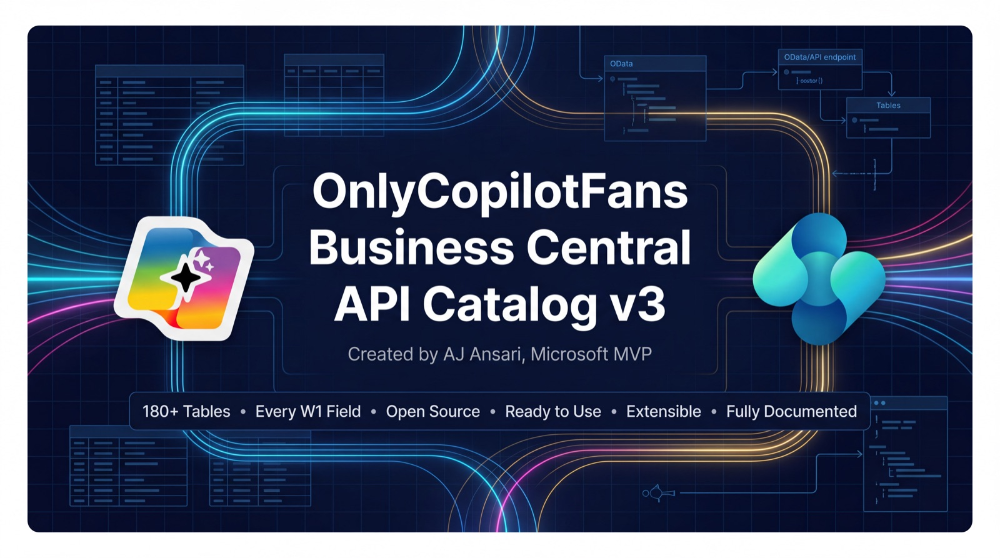

# OnlyCopilotFans Business Central API Catalog v3.1

**Publisher:** OnlyCopilotFans  
**API Version:** v3.1 (all endpoints also served at v3.0 for existing integrations)  
**App Version:** 3.1.3.0  
**Object Range:** 90800–91099  
**BC Version:** Business Central 2025 Wave 2 (v27.5+)  
**Date:** June 9, 2026 (v3.0) — updated July 7, 2026 (v3.1) — updated September 9, 2026 (v3.1.2, v3.1.3)  
**Created by:** AJ Ansari ( [Email](mailto:aj@onlycopilotfans.com) | [LinkedIn](https://linkedin.com/in/ajansari) )

## Overview

**OCPF APIs** is a Microsoft Dynamics 365 Business Central extension that exposes 187 standard BC tables as OData v4 API endpoints. It is designed to be a comprehensive, ready-to-use API layer for integrations, reporting tools, and external applications that need reliable, structured access to Business Central data without requiring custom development per table.

Each API page maps directly to a standard BC source table and exposes every standard field from that table, with the deliberate exception of fields that are specific to country/region localizations. This keeps the API surface globally portable — the same endpoints and field set work consistently across any BC environment regardless of the localization installed.

## For full documentation, view Documentation.md in the [Documentation](https://github.com/ajansari/ocpfBCAPIsV3/blob/main/Documentation/Documentation.md) folder.

## What changed

### v3.1.3 (September 2026)

- **New Access Control category** (`ocpf_accessControl`, 4 pages, v3.1-only, object IDs 91000–91003; app ID range extended to 90800–91099) — for automations, external apps, and agents that configure BC security:
  - `ocpfPermissionSets` (read) — every permission set in the environment: base, extension (AppSource/PTE), and tenant-defined, each with its `scope` and `appId`.
  - `ocpfPermissionSetPermissions` (read) — the fully expanded object-level permissions of any set.
  - `ocpfUsers` (read) — users and security groups (groups are the `AAD Group` / `Windows Group` rows; their `userSecurityId` is the group's assignee ID).
  - `ocpfPermissionSetAssignments` (read/write) — assign an existing permission set to a **user** (POST) or revoke it (DELETE). Requires SUPER or the SECURITY permission set.
- **What these endpoints can and cannot do** — you can list permission sets and their permissions and assign existing sets to individual users. You **cannot** create or edit custom (tenant) permission sets, add or change individual permissions, or assign a permission set to a **security group**; do those in the Business Central UI. See **Key characteristics → Access control endpoints** in [Documentation.md](https://github.com/ajansari/ocpfBCAPIsV3/blob/main/Documentation/Documentation.md) for the full boundary.
- Catalog: 187 entities (135 editable / 52 read-only). `OCPF - READ` covers all 187; `OCPF - READ/WRITE` covers 135. App version 3.1.2.0 → 3.1.3.0.

### v3.1.2 (September 2026)

- **18 pages corrected from read-only to editable** — setup and working-document entities that had been mis-marked as read-only now support POST/PATCH/DELETE: Projects, Project Tasks / Planning Lines / Posting Groups, Fixed Assets, FA Posting Groups, FA Depreciation Books, General Journal Templates & Batches, Price List Headers & Lines, Company Information, Document Attachments, Reminders (header/line), Finance Charge Memos (header/line), and Calendar Absence Entries. Catalog is now **134 editable / 49 read-only**; `OCPF - READ/WRITE` covers 134 pages.
- **`DataAccessIntent = ReadOnly` on the 49 immutable pages** — ledgers, registers, and posted documents now serve their GET queries from the SQL read-only replica, offloading reporting/extract load from the primary. Non-breaking; the only effect is a few seconds of replication lag on freshly written data. Applies to both `/v3.0/` and `/v3.1/`.
- **App version** 3.1.1.0 → 3.1.2.0. No endpoint or contract changes.

### v3.0 → v3.1 (July 2026)

v3.1 is an **additive, non-breaking** release — all v3.0 endpoints keep working unchanged.

- **Dual-versioned endpoints** — every existing API page is served at both `/v3.0/` and `/v3.1/` base URLs. New entities are published at v3.1 only, so **new integrations should use `/v3.1/`**.
- **170 missing standard fields restored on 22 existing entities** — v3.0's generator had skipped every field with parentheses in its name (e.g. `Credit Limit (LCY)` on Customer, `Cost Amount (Actual)` on Value Entry, and the `(LCY)`/`(Qty.)` flow fields on Customer, Vendor, Item, and ledger entities). These appear on both versions, which is additive and safe for existing OData clients.
- **65 new entities (v3.1 only)** — Ship-to Addresses, a new **Manufacturing** category (34 entities: work/machine centers, routings, production BOMs, production orders, capacity, and assembly management), and a new **Service Management** category (30 entities: service items, service documents, contracts, loaners, ledgers, and posted service documents).
- **5 more entities (v3.1.1)** — Vendor Bank Accounts (Master Data); Sales Line Discounts and Customer Invoice Discounts (Sales); Purchase Line Discounts and Vendor Invoice Discounts (Purchasing). The Sales Line Discount and Purchase Line Discount API pages remain available even though the underlying BC tables are marked for deprecation, because the V16 pricing model is still an opt-in feature in BC. We will adjust this in the future once Microsoft enables the new pricing tables by default.
- **Fixes & housekeeping** — corrected tooltips that had shifted onto neighboring fields, expanded permission sets (READ: 183 pages, READ/WRITE: 116), app version 3.1.1.0, and git tags `v3.0.0.0` / `v3.1.0.0` (diff them for the full contract delta).

The complete field-by-field delta is in [ChangeLog.md](https://github.com/ajansari/ocpfBCAPIsV3/blob/main/Documentation/ChangeLog.md).

## Roadmap

- ~~Service Management~~ — ✅ shipped in v3.1
- ~~Manufacturing (Production)~~ — ✅ shipped in v3.1 (including Assembly)
- ~~`DataAccessIntent = ReadOnly` on read-only pages, for read-replica offload~~ — ✅ shipped in v3.1.2 (also corrected 18 pages that should have been editable)
- ~~APIs for permission / access-control tables~~ — ✅ shipped in v3.1.3 as the `ocpf_accessControl` category: read access to permission sets, their permissions, and users; read/write assignment of existing permission sets to **individual users**. Creating custom permission sets and assigning to security groups are not included — see the Documentation "Access control endpoints" section.

